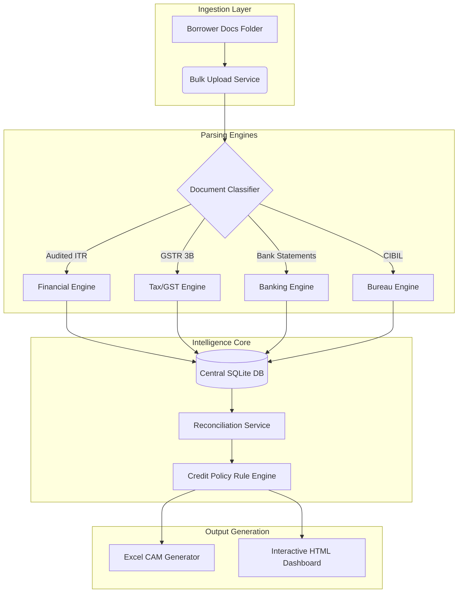

# 🏛️ Credit Underwriting Intelligence Suite (CUIS)

**An Enterprise-Grade Automated Credit Underwriting & Risk Analytics Platform**

*Transforming days of manual financial analysis into minutes of automated, rule-based intelligence.*

---

## 🎯 The Business Problem

Commercial lending is plagued by slow, manual underwriting processes. Credit analysts spend hours—sometimes days—manually copying data from complex PDF financial statements (ITRs, Bank Statements, GSTRs, CIBIL reports) into Excel Credit Assessment Memos (CAMs). 

This manual process leads to:
- ⏳ **Slow Turnaround Times:** Delayed loan disbursements.
- 📉 **Human Error:** Mistakes in complex working capital ratio calculations.
- 🔍 **Limited Risk Visibility:** Hidden diversion risks buried inside thousands of bank transactions.

## 🚀 The Solution: CUIS

CUIS is an internal fintech platform designed to completely automate commercial borrower onboarding. 

By simply pointing the engine to a folder of raw PDFs, CUIS:
1. **Ingests & Parses:** Extracts P&L, Balance Sheet, GST, and Banking ledgers.
2. **Reconciles:** Harmonizes data across different sources (e.g., matching GST Sales to Audited Sales).
3. **Applies Risk Policy:** Runs the data through a configurable Rule Engine.
4. **Generates Outputs:** Spits out a fully-formatted, bank-ready Excel CAM and a beautiful interactive HTML Dashboard.

### 💡 Business Impact

| Metric | Manual Underwriting | CUIS Automation |
| :--- | :--- | :--- |
| **CAM Preparation Time** | 2–3 Days | **Under 2 Minutes** |
| **Working Capital Ratios** | Manual Spreadsheet Logic | **Automated & Realigned** |
| **Bank Statement Analysis** | Sampling only | **100% Transaction Parsing** |
| **Diversion Risk Detection** | Reactive / Manual | **Proactive Alerts (Rule Engine)** |
| **Audit Traceability** | Low (Spreadsheet versions) | **High (Centralized SQLite DB)** |

---

## 🏗️ Live Architecture

CUIS was built using **Clean Architecture** principles, strictly separating the parsing logic, business rules, and presentation layers.

---

## 🎥 Platform Walkthrough (Live Execution)

Watch the engine ingest raw financial PDFs, parse the data, and instantly generate the interactive dashboard:

  

---

## 🏆 Explore the Final Outputs (Recruiter Review)

Don't just watch the video—explore the actual outputs generated by the pipeline for **Harika Shipping & Logistics**:

### 1. 📈 The Interactive Web Dashboard
Experience the real-time working capital gauges, dynamic 3-year historical tables, and the glassmorphism UI. It is 100% self-contained.
👉 **[Download & Open `dashboard.html` in your browser](demo/output_samples/dashboard.html)**

### 2. 📊 The Bank-Ready Excel CAM
See how the parsed data is structured directly into a complex, bank-mandated Credit Assessment Memo layout.
👉 **[Download & Open the Excel CAM Workbook](demo/output_samples/CAM_3_FY24h.xlsx)**

---

### Step-by-Step Pipeline Breakdown:

1. **Document Ingestion:** The engine reads complex multi-page audited financial PDFs, identifying manufacturing expenses to calculate the exact Tangible Net Worth (TNW).
2. **Reconciliation & Policy Engine:** Data is cross-verified. Cost of Sales is recalculated by marrying raw purchases with direct operational expenses to produce bank-standard Creditor Days.
3. **Automated Generation:** The centralized SQLite database feeds the HTML compiler and Excel OpenPyXL writer to generate the artifacts linked above.

---

## 🧠 Engineering Highlights & Decisions

As a developer, I focused heavily on ensuring this platform wasn't just a "script", but a scalable enterprise architecture:

- **Modular Clean Architecture:** Separated the Financial, Banking, and Risk Intelligence into highly independent services. Adding a new parser (e.g., EPFO statements) requires zero changes to the core engine.
- **Configurable Rule Engine:** Instead of hardcoding business logic (like `if current_ratio < 1.0`), I implemented a central Policy Engine. This allows Risk Managers to tweak thresholds without touching the Python code.
- **Why SQLite?** For v1.0, SQLite allows the platform to be completely portable and self-contained without requiring massive database server infrastructure, perfect for initial banking proofs-of-concept.
- **Regex + Layout-Aware Parsing:** Built custom PDF extraction logic that understands spatial accounting layouts (e.g., extracting values strictly before the "TO INDIRECT EXPENSES" line in a Trading Account).

---

## 📚 Deep Dive: The Engineering Book

For those interested in the deep technical implementations and business logic behind this platform, I have documented the entire journey in the **[PROJECT_BOOK](PROJECT_BOOK/)**:

* 📘 **[Volume I: Business Domain](PROJECT_BOOK/Vol_I_Business_Domain.md)** - Understanding Commercial Credit & CAMs.
* 📙 **[Volume II: Architecture](PROJECT_BOOK/Vol_II_Architecture.md)** - The Clean Architecture and Rule Engines.
* 📗 **[Volume III: Implementation](PROJECT_BOOK/Vol_III_Implementation.md)** - Deep dive into Regex Parsing and Dashboard Generation.

---

## 🗺️ Future Roadmap

See the [ROADMAP.md](ROADMAP.md) for our vision of evolving CUIS into a Cloud SaaS platform with an AI-powered conversational underwriter.

---

  <b>Built with passion for Fintech and Risk Analytics by Sasidhar Naram.</b>

