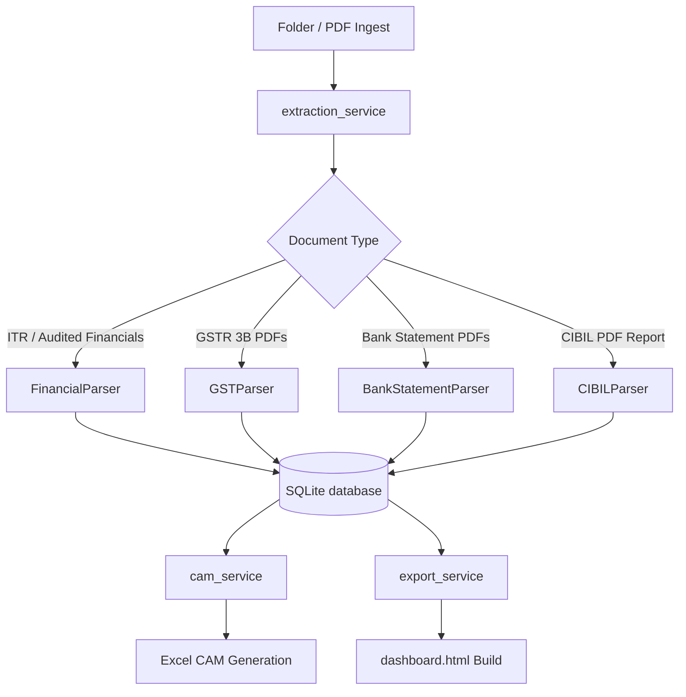

# 📊 Credit Underwriting & Risk Intelligence Suite (CUIS)

[](https://www.python.org/)
[](https://www.sqlite.org/)
[](https://developer.mozilla.org/)
[](https://openpyxl.readthedocs.io/)

An automated **Credit Risk Analysis & Underwriting Suite** designed for commercial bankers, credit officers, and financial underwriters. CUIS streamlines commercial borrower onboarding, automatically ingests and parses scanned/digital financial PDFs (ITR, GST, Bank Statements, CIBIL reports), performs complex working capital and leverage reconciliations, and outputs interactive dashboards alongside standardized bank-ready **Credit Assessment Memo (CAM)** Excel models.

---

## 🚀 Key Features

* 📂 **Bulk Folder Ingestion Engine:** Automated ingestion of commercial borrower files (single folder paths) containing unstructured financial documents.
* 📑 **Audited Financials PDF Parser:** Dynamically parses complex multi-page Profit & Loss (P&L) statements, Balance Sheets, and Trading accounts, including robust handling of manufacturing/direct operating expenses.
* 🔄 **Working Capital Cycle Realignment:** Automatically calculates Debtors, Creditors, and Inventory days using exact Cost of Sales and Sales denominators, realigned to standard Indian banking guidelines.
* 📈 **3-Year Historical Trends:** Automatically generates side-by-side comparison tables in the web dashboard for financial positions and ratios.
* 💻 **Interactive Scorecard & Gauges:** Self-contained dashboard with zero dependencies, rendering real-time working capital dials, cash flow charts, and warning alerts for overdraft diversion risks.
* 🟢 **Standardized Excel CAM Generation:** Automatically writes audited, banking, and GST sales figures into the bank-mandated Excel templates, preserving the template formulas and formatting.

---

## 📐 Architecture & Workflow



---

## 📂 Project Structure

```text
├── Credit_Underwriting_Intelligence_Suite/
│   ├── app/
│   │   └── main.py              # FastAPI-like HTTP and Static UI Web Server (Port 5000)
│   ├── config/
│   │   └── settings.py          # Environment settings and output directory mapping
│   ├── database/
│   │   └── db_manager.py        # SQLite Database connection, schema definition & migrations
│   ├── parsers/
│   │   ├── financial_parser.py  # Audited financials parsing rules (opening/closing Capital, direct costs)
│   │   ├── gst_parser.py        # GSTR 3B PDF reader & sales calculator
│   │   └── bank_parser.py       # Bank statement transactions ledger parsing
│   └── services/
│       ├── extraction_service.py# Coordinates auto-extraction & SQLite writes
│       ├── cam_service.py       # Populates Excel CAM rows (Purchases, direct expenses, TNW, monthly GST)
│       └── export_service.py    # Generates Power BI / dashboard CSV files
├── build_dashboard.py           # Compiles Fact_Financials.csv and builds the HTML dashboard
├── dashboard.html               # Output self-contained credit analysis web portal
├── CAM_Template.xlsx            # Standardized credit memo excel layout
└── README.md                    # This file
```

---

## 📝 Case Study: Harika Shipping & Logistics

To validate the intelligence suite, we analyzed **Harika Shipping & Logistics** by ingesting 20 unstructured PDFs (3 Years of ITRs, 1 Year of Bank Statements, 15 Months of GST filings, and a CIBIL credit report).

### 1. Working Capital Cycle Alignment
Originally, the dashboard calculated creditor days using raw purchases (15 Lakhs), resulting in a massive mismatch (`19,835 Days`). CUIS successfully parsed **27.66 Crores** of direct operating expenses (godown maintenance, vessel expenses, storage charges, and freight) from the trading account, correcting **Creditor Days** to exactly **107 Days**, matching the bank guidelines.

### 2. Tangible Net Worth (TNW) Correction
Commercial balance sheets often represent Capital account balances at the beginning of the year. CUIS dynamically adjusted the extracted Net Worth by adding the current year's profit (PAT) of `78.08 Lakhs`, matching the final audited Tangible Net Worth of **544.67 Lakhs** exactly.

### 3. Financial Metrics Verification Matrix (FY24)

| Particulars | Bank-audited CAM | CUIS Generated Excel CAM | Interactive HTML Dashboard |
| :--- | :--- | :--- | :--- |
| **Sales / Receipts** | `3133.48 Lakhs` | `3133.48 Lakhs` | `31.33 Crores` |
| **Manufacturing/Direct Expenses** | `2766.13 Lakhs` | `2766.13 Lakhs` | `27.66 Crores` |
| **Employee Benefits Expenses** | `56.79 Lakhs` | `56.79 Lakhs` | `56.79 Lakhs` |
| **Profit After Tax (PAT)** | `78.08 Lakhs` | `78.08 Lakhs` | `78.08 Lakhs` |
| **Tangible Net Worth (TNW)** | `544.67 Lakhs` | `544.67 Lakhs` | `544.67 Lakhs` |
| **Secured Borrowings** | `909.96 Lakhs` | `909.96 Lakhs` | `909.96 Lakhs` |
| **Sundry Creditors** | `815.24 Lakhs` | `815.24 Lakhs` | `815.24 Lakhs` |
| **Sundry Debtors** | `1491.50 Lakhs` | `1491.50 Lakhs` | `1491.50 Lakhs` |
| **Debtor Days** | `173.8 Days` | `173.8 Days` (Formula) | `173.8 Days` (Gauge) |
| **Creditor Days** | `107.0 Days` | `107.0 Days` (Formula) | `107.0 Days` (Gauge) |
| **Net WC Cycle** | `66.8 Days` | `66.8 Days` (Formula) | `66.8 Days` (Gauge) |
| **Current Ratio** | `1.24` | `1.24` (Formula) | `1.24` |

---

## 🛠️ Installation & Setup

1. **Clone the Repository:**
   ```bash
   git clone https://github.com/<your-username>/Credit-Risk-Underwriting-Suite.git
   cd Credit-Risk-Underwriting-Suite
   ```

2. **Set up Virtual Environment:**
   ```bash
   python -m venv .venv
   source .venv/bin/activate  # On Windows: .venv\Scripts\activate
   ```

3. **Install Dependencies:**
   ```bash
   pip install pandas openpyxl pypdf openpyxl pydantic
   ```

4. **Start the Web Service:**
   ```bash
   python Credit_Underwriting_Intelligence_Suite/app/main.py
   ```

5. **Access the Interface:**
   Navigate to `http://localhost:5000` in your web browser. From here, you can onboard borrowers, bulk-upload PDF documents, monitor parsing actions, and download your regenerated Excel CAM and interactive dashboard.
