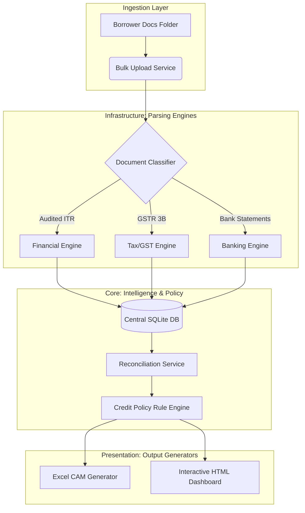

<div align="center">

```text
━━━━━━━━━━━━━━━━━━━━━━━━━━━━━━━━━━━━━━

      CREDIT UNDERWRITING
     INTELLIGENCE SUITE (CUIS)

Enterprise Lending Platform

Built by
Sasidhar Naram

━━━━━━━━━━━━━━━━━━━━━━━━━━━━━━━━━━━━━━
```

[](https://www.python.org/)
[](https://www.sqlite.org/)
[](#)
[](#)

[Demo](#-platform-walkthrough) • [Architecture](#-live-architecture) • [Documentation](docs/) • [Engineering Decisions](#-engineering-decisions) • [Business Problem](#-why-does-this-product-exist)

</div>

---

## 🎯 Why does this product exist?

Commercial lenders spend hours manually preparing Credit Assessment Memorandums (CAMs). They stare at 50-page audited financial PDFs, manually extract complex working capital numbers into messy spreadsheets, and sample thousands of bank transactions looking for diversion risks. 

**CUIS was designed to transform this fragmented workflow into a modular decision-support platform.** It combines financial intelligence, banking analytics, configurable credit policies, explainable risk scoring, and automated CAM generation into a single pipeline.

---

## 🎥 Platform Walkthrough

Watch the engine ingest raw financial PDFs, run the risk policy, and instantly generate the interactive dashboard:

<div align="center">
  
</div>

---

## ⚙️ The Data Pipeline

```text
[ Raw PDF Documents ]

         ↓

[ Document Classifier ]

         ↓

[ Financial Parser ] ── [ GST Parser ] ── [ Banking Parser ]

         ↓

[ Central SQLite Brain ]

         ↓

[ Reconciliation Service ]

         ↓

[ Configurable Rule Engine ]

         ↓

[ Excel CAM Generator ] ── [ HTML Interactive Dashboard ]
```

---

## 📈 Business Impact

| Traditional Underwriting   | CUIS (The Platform)       |
| -------------------------- | ------------------------- |
| Manual ratio calculations  | Fully Automated           |
| Multiple spreadsheets      | Unified Python backend    |
| 2–3 Days CAM preparation   | Under 2 Minutes           |
| Inconsistent observations  | Rule-assisted analysis    |
| Limited risk visibility    | Dashboard-driven insights |

---

## 🏗️ Live Architecture

CUIS implements **Clean Architecture** to separate parsing infrastructure from core business rules. 



---

## 🧩 Module Deep Dives

Every engine in CUIS is built as an independent microservice. Dive into the documentation for each module:

* 📘 **[The Financial Intelligence Engine](docs/Financial_Engine.md)**
* 📙 **[The Banking Analytics Engine](docs/Banking_Engine.md)**
* 📗 **[The Risk Policy Engine](docs/Risk_Engine.md)**
* 📕 **[The CAM Generator & Dashboard](docs/CAM_Dashboard.md)**

---

## 🧠 Engineering Decisions

Building an enterprise platform requires choosing the right tools for the right reasons.

> **Decision:** Configurable Rule Engine
> **Instead of:** Machine Learning Models
> **Reason:** Credit underwriting requires 100% explainability, auditability, and regulatory policy compliance. A black-box ML model cannot tell an auditor *why* a loan was rejected. A Rule Engine provides hard logic based on banking mandates.

> **Decision:** SQLite
> **Instead of:** PostgreSQL / SQL Server
> **Reason:** v1.0 of this platform prioritizes local portability and zero-infrastructure deployment for bank analysts' laptops. SQLite provides relational ACID compliance while keeping the app self-contained. The clean architecture allows a 10-line migration to Postgres in the future.

> **Decision:** Spatial-Aware Regex Parsing
> **Instead of:** Standard OCR / Text Flattening
> **Reason:** In accounting, the spatial position of a number (e.g., inside the "Trading Account" vs the "P&L") completely changes its meaning. Standard PDF flatteners destroy this context. We built regex that captures specific structural blocks before extracting values.

---

## 💡 Lessons Learned

While implementing CUIS, I learned that **many underwriting problems are not algorithmic—they are workflow problems.** 

This realization led me to separate business rules from application logic through a configurable Credit Policy Engine. Although an AI model could eventually enhance risk prediction, the initial platform must prioritize explainability and auditability, reflecting how actual credit sanctioning decisions are made in practice.

---

## 🚀 Version History

```text
Version 0.1 
Database & Architecture Skeleton
↓
Version 0.5 
Financial Extraction Engine
↓
Version 0.8 
Reconciliation & Risk Rules
↓
Version 1.0 
The Enterprise Platform (Current)
```

---

<div align="center">
  <b>Built by <a href="https://github.com/snaram-hash">Sasidhar Naram</a></b><br>
  <i>Finance • Credit Analytics • Data Science</i>
</div>
