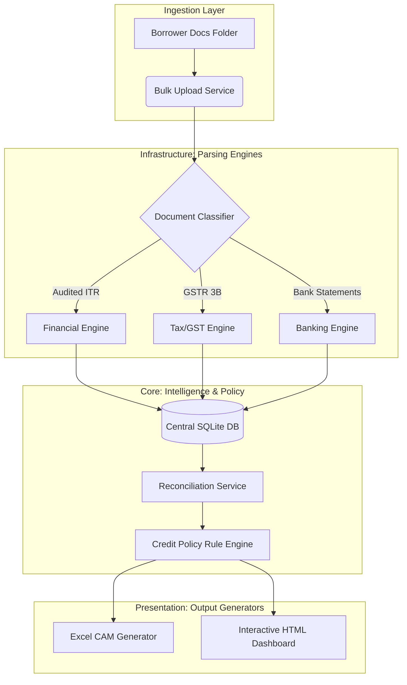

<div align="center">

```text
━━━━━━━━━━━━━━━━━━━━━━━━━━━━━━━━━━━━━━━━━━━━━━━━━━━━━━━━

       CREDIT UNDERWRITING INTELLIGENCE SUITE
                      (CUIS)

         Enterprise Decision Support Platform

━━━━━━━━━━━━━━━━━━━━━━━━━━━━━━━━━━━━━━━━━━━━━━━━━━━━━━━━
```

[](https://www.python.org/)
[](https://www.sqlite.org/)
[](#)

[🎥 Watch Demo](#-platform-walkthrough) &nbsp;•&nbsp; [🏗 System Architecture](docs/03_System_Architecture.md) &nbsp;•&nbsp; [📊 Dashboard Preview](demo/output_samples/dashboard.html) &nbsp;•&nbsp; [📘 Engineering Docs](docs/) &nbsp;•&nbsp; [📄 Case Study](docs/Case_Study.md) &nbsp;•&nbsp; [💻 Source Code](app/)

</div>

---

## 🎯 Executive Summary

Commercial lenders spend days manually preparing Credit Assessment Memorandums (CAMs). They transcribe 50-page audited financial PDFs, extract working capital ratios into fragmented spreadsheets, and sample thousands of bank transactions looking for diversion risks. 

**CUIS was designed to transform this fragmented workflow into a modular decision-support platform.** It integrates financial intelligence, banking analytics, configurable credit policies, explainable risk scoring, and automated CAM generation into a single deterministic pipeline.

---

## 🎥 Platform Walkthrough

Watch the engine ingest unstructured financial PDFs, execute the risk policy, and instantly generate the interactive dashboard:

<div align="center">
  
</div>

---

## 📈 Business Impact

By replacing manual entry with a fully automated, deterministic pipeline, CUIS achieves:

| Traditional Underwriting   | CUIS (The Platform)       |
| -------------------------- | ------------------------- |
| Manual ratio calculations  | **Fully Automated**       |
| Multiple spreadsheets      | **Unified Python backend**|
| 2–3 Days CAM preparation   | **Under 2 Minutes**       |
| Inconsistent observations  | **Rule-assisted analysis**|
| Limited risk visibility    | **Dashboard-driven insights** |

---

## 🏗️ System Architecture

CUIS implements **Clean Architecture** to separate parsing infrastructure from core business rules. 



---

## 📘 Engineering Documentation Portal

This repository serves as the complete documentation portal for the CUIS platform.

### Foundation & Business Logic
* [01. Executive Summary](docs/01_Executive_Summary.md)
* [02. The Business Problem](docs/02_Business_Problem.md)
* [03. System Architecture](docs/03_System_Architecture.md)

### Technical Design
* [04. Module Design (Engines)](docs/04_Module_Design.md)
* [05. Database Schema & Design](docs/05_Database_Design.md)
* [06. Risk Policy Engine](docs/06_Risk_Engine.md)
* [07. Excel CAM & Dashboard Generation](docs/07_CAM_Generation.md)
* [08. API & Services Design](docs/08_API_Design.md)

### Lifecycle & Strategy
* [09. Testing Strategy](docs/09_Testing.md)
* [10. Future Product Roadmap](docs/10_Future_Roadmap.md)

---

## 🧠 Architecture Decision Records (ADRs)

We document our major engineering decisions explicitly to demonstrate maturity and maintainability:

* **[ADR-001: Why we use SQLite for v1.0 data storage](docs/adr/ADR-001-SQLite.md)**
* **[ADR-002: Why we built a Configurable Rule Engine instead of using ML](docs/adr/ADR-002-Rule-Engine.md)**
* **[ADR-003: Why we use Excel Injection for CAM Generation](docs/adr/ADR-003-CAM-Generation.md)**
* **[ADR-004: Why we use Spatial-Aware Regex over Standard OCR](docs/adr/ADR-004-Regex-Parsing.md)**

---

## 💡 Lessons Learned

While implementing CUIS, I learned that **many underwriting problems are not algorithmic—they are workflow problems.** 

This realization led me to separate business rules from application logic through a configurable Credit Policy Engine. Although an AI model could eventually enhance risk prediction, the initial platform must prioritize explainability and auditability, reflecting how actual credit sanctioning decisions are made in practice.

---

<div align="center">
  <b>Built by <a href="https://github.com/snaram-hash">Sasidhar Naram</a></b><br>
  <i>Finance • Credit Analytics • Data Science</i>
</div>
