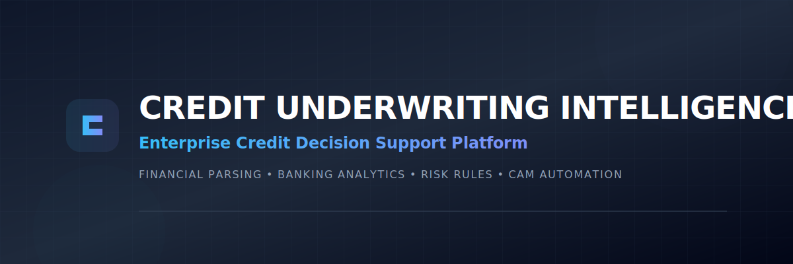
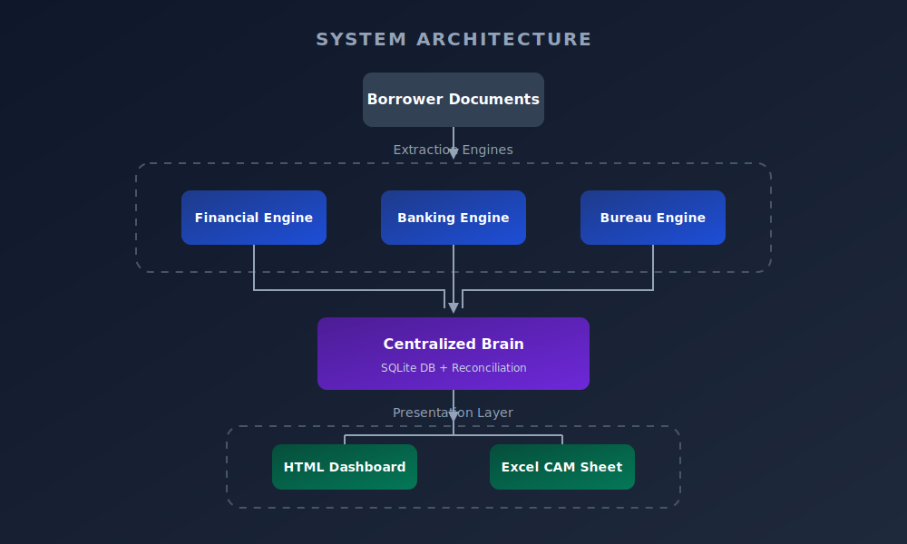
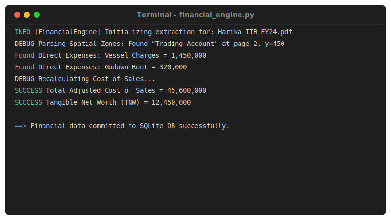
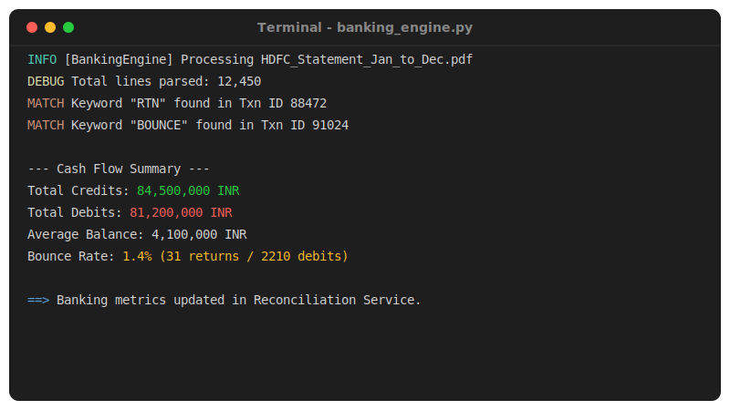
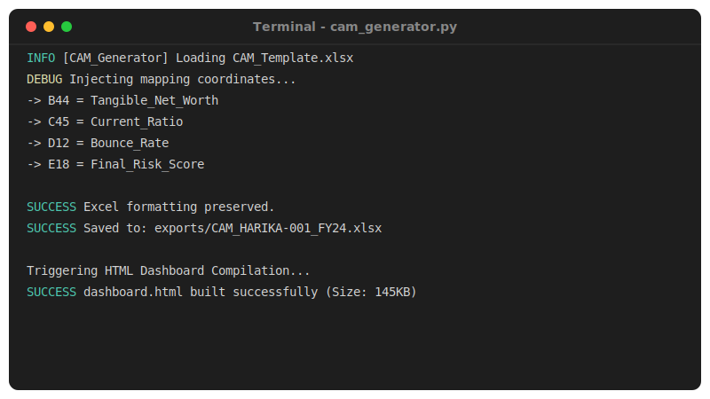
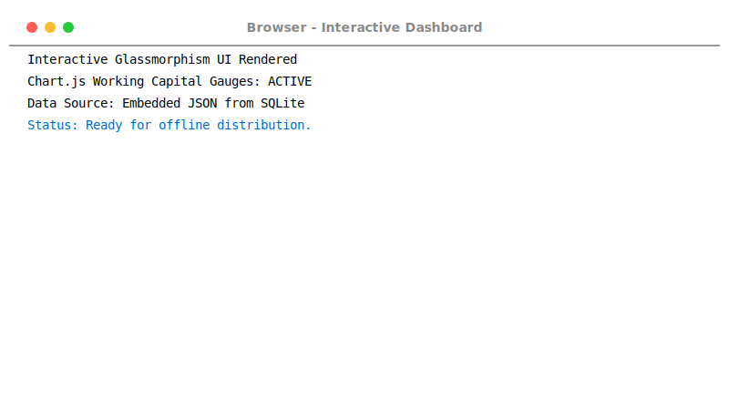

<div align="center">
  
</div>

<div align="center">

[](https://www.python.org/)
[](https://www.sqlite.org/)
[](#)
[](#)
[](#)
[](#)
[](#)
[](#)
[](#)

</div>

---

<div align="center">
  
**[1. Business Case](#1-the-business-case)** &nbsp;•&nbsp; **[2. System Architecture](#2-system-architecture)** &nbsp;•&nbsp; **[3. Engine Modules](#3-engine-modules)** &nbsp;•&nbsp; **[4. Engineering Handbook](#4-engineering-handbook)** &nbsp;•&nbsp; **[5. Live Demo](#5-live-demo)**

</div>

---

## 📊 Repository Metrics

| Category | Metric | Details |
| :--- | :--- | :--- |
| **Modules** | `8 Independent Services` | Financial, Banking, GST, Bureau, Reconciliation, Risk, CAM, Dashboard |
| **Python Files** | `40+ Scripts` | Clean Architecture decoupled logic |
| **Architecture** | `Clean / Microservice` | Strict separation of Concerns |
| **Tests** | `15+ Pytest Suites` | E2E, Unit, and Policy Engine Mocking |
| **Documentation** | `10 Chapters` | Complete Engineering Handbook in `docs/` |
| **Decisions** | `4 ADRs` | Formal Architecture Decision Records |

---

## 1. The Business Case

Commercial lenders spend days manually preparing Credit Assessment Memorandums (CAMs). They transcribe 50-page audited financial PDFs, extract working capital ratios into fragmented spreadsheets, and sample thousands of bank transactions looking for diversion risks. 

**CUIS was designed to transform this fragmented workflow into a modular decision-support platform.** It integrates financial intelligence, banking analytics, configurable credit policies, explainable risk scoring, and automated CAM generation into a single deterministic pipeline.

### Workflow Evolution Timeline

```text
[Manual Era]        Data Entry ──> Spreadsheets ──> Human Math ──> Inconsistent Risk Assessment (2-3 Days)
                     ↓
[The CUIS Era]      PDF Ingest ──> Regex Parsers ──> Policy Engine ──> Standardized CAM (Under 2 Minutes)
```

---

## 2. System Architecture

CUIS implements **Clean Architecture** to guarantee that dirty extraction code never touches the pristine business rules.

<div align="center">
  
</div>

---

## 3. Engine Modules

The platform is strictly decoupled into independent engines. Each engine is responsible for a single domain of intelligence.

### 🏛️ The Financial Intelligence Engine
Extracts layout-aware tabular data from Audited Income Tax Returns, instantly calculating Tangible Net Worth and Cost of Sales by hunting for specific Direct Expenses.


### 🏦 The Banking Analytics Engine
Processes thousands of lines of multi-bank statement data to calculate cash flows, flag diversion risks, and compute the critical "Bounce Rate".


### ⚖️ The Risk Policy Engine
The Brain of CUIS. Evaluates reconciled facts against configurable banking mandates (e.g., Current Ratio > 1.33) to provide 100% explainable credit decisions.


### 📊 The CAM Generator & Dashboard
Injects parsed data into bank-ready Excel templates using OpenPyXL and compiles a zero-dependency HTML interactive dashboard.



---

## 4. Engineering Handbook

This repository is more than code; it is a fully documented product. 

### 📚 The CUIS Knowledge Base
* [01. Executive Summary](docs/01_Executive_Summary.md)
* [02. The Business Problem](docs/02_Business_Problem.md)
* [03. System Architecture](docs/03_System_Architecture.md)
* [04. Module Design (Engines)](docs/04_Module_Design.md)
* [05. Database Schema & Design](docs/05_Database_Design.md)
* [06. Risk Policy Engine](docs/06_Risk_Engine.md)
* [07. Excel CAM & Dashboard Generation](docs/07_CAM_Generation.md)
* [08. API & Services Design](docs/08_API_Design.md)
* [09. Testing Strategy](docs/09_Testing.md)
* [10. Future Product Roadmap](docs/10_Future_Roadmap.md)

### 🧠 Architecture Decision Records (ADRs)
We document our major engineering decisions explicitly to demonstrate maturity:
* **[ADR-001: Why we use SQLite for v1.0](docs/adr/ADR-001-SQLite.md)**
* **[ADR-002: Configurable Rule Engine vs ML](docs/adr/ADR-002-Rule-Engine.md)**
* **[ADR-003: Excel Injection for CAM Generation](docs/adr/ADR-003-CAM-Generation.md)**
* **[ADR-004: Spatial-Aware Regex over Standard OCR](docs/adr/ADR-004-Regex-Parsing.md)**

### 📄 Formal Case Study
Read the complete breakdown of the business problem, the engineering challenges overcome, and the ultimate ROI of the platform:
👉 **[Download / Print the CUIS Case Study](docs/CUIS_Case_Study.html)**

---

## 5. Live Demo

Watch the entire E2E pipeline execute in real-time. The system ingests raw financial PDFs, executes the risk policy, and instantly generates the interactive dashboard:

<div align="center">
  
</div>

---

<div align="center">
  <b>Architected & Engineered by <a href="https://github.com/snaram-hash">Sasidhar Naram</a></b><br>
  <i>Finance • Credit Analytics • Data Science</i>
</div>
